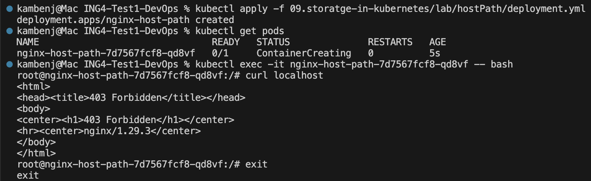
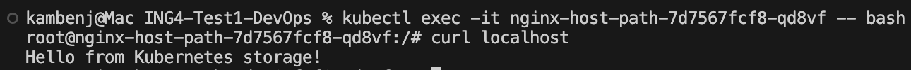
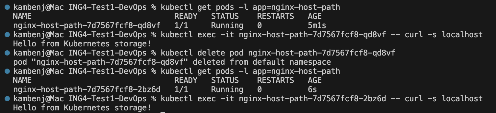

2. Run a pod applying configuration

3. Create /mnt/hostPath/index.html file with some content inside a VM

4. Verify

When a Pod is deleted, the data in the hostPath volume remains on the node.

When multiple replicas of a Pod are created, they all share and access the same hostPath volume on the node.
