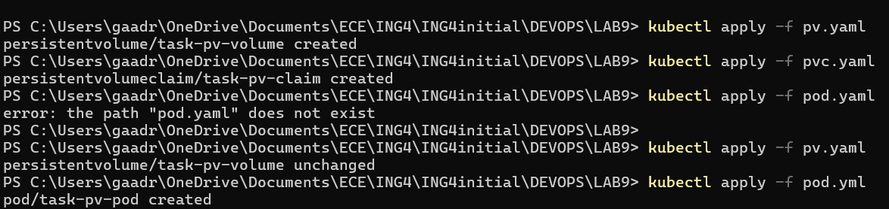
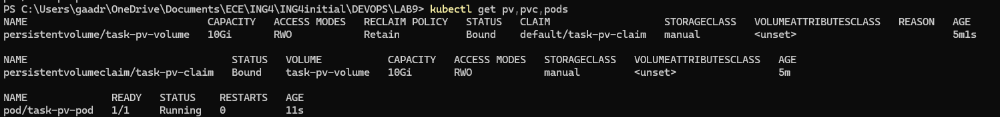
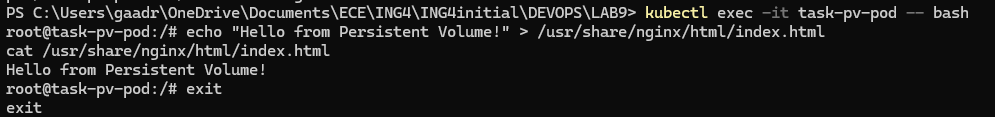

3. Use PersistentVolume

1. Apply the configuration files

2. Check the status of the PersistentVolume, Claim and Pod

3. Create and read the index.html file inside the container

4. Verify data persistence after Pod deletion and recreation

When the Pod is deleted and recreated, the data in the PersistentVolume remains available on the node.
