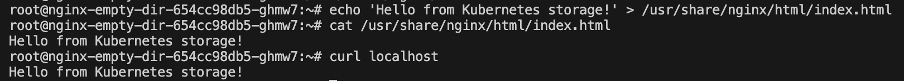
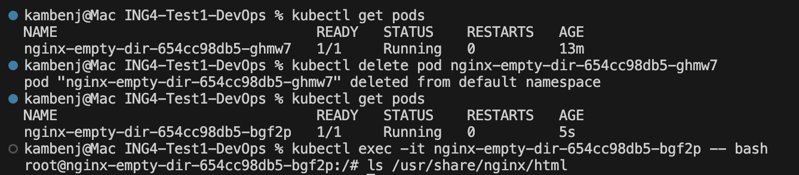
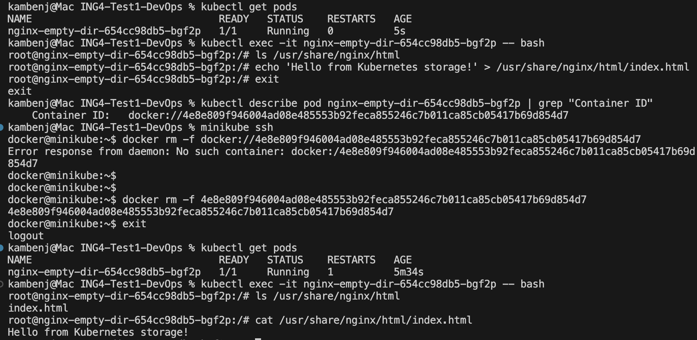

3. Enter to a container and curl localhost

4. Create index.html file with some content inside a container

5. Verify

emptyDir lives only as long as the Pod exists, nothing more.

emptyDir is reset only when the Pod is deleted, not when a container restarts.
